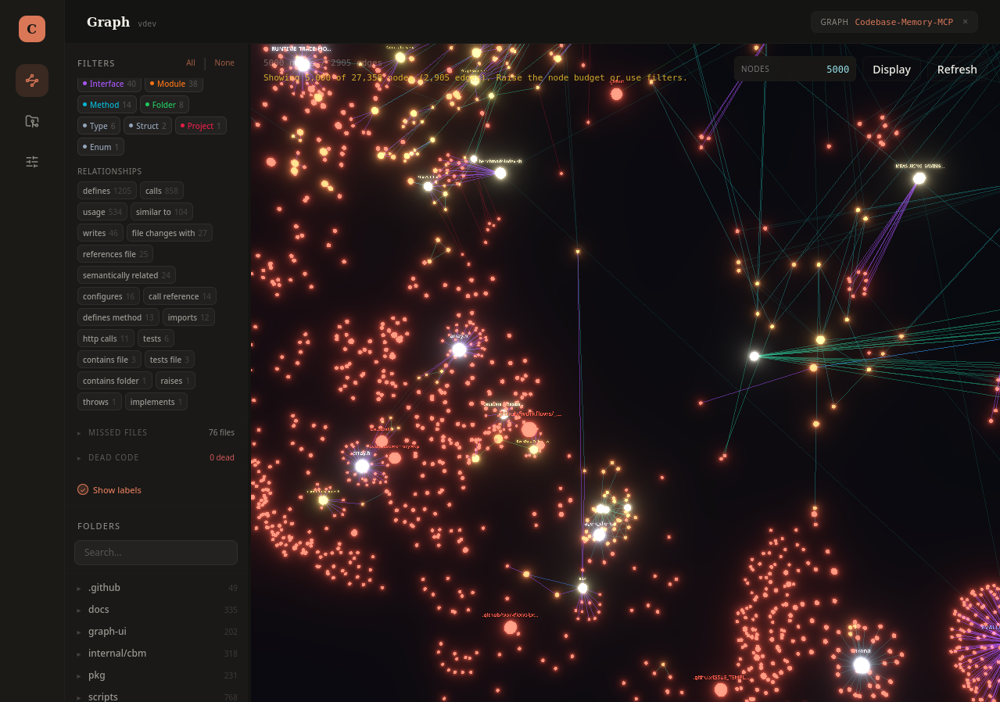

<div align="center">

# Codebase Memory

**El grafo de conocimiento de tu código, en local — para que tu agente de IA deje de leer archivo por archivo.**

Indexa cualquier repositorio con tree-sitter y construye un grafo persistente de funciones,
clases, llamadas, rutas HTTP y dependencias cruzadas. Claude Code (o cualquier agente
compatible con MCP) lo consulta en vez de hacer grep archivo por archivo — hasta 120x
menos tokens para responder lo mismo. Todo corre en tu máquina, nada sale de ella.


</div>

---

## Qué es

Cuando un agente de IA explora un repositorio a base de `grep`/`read` archivo por archivo,
gasta muchísimos tokens en encontrar algo tan simple como "¿quién llama a esta función?".
**Codebase Memory** resuelve eso una sola vez por repo: lo indexa con
[tree-sitter](https://tree-sitter.github.io/tree-sitter/) (162 lenguajes) y guarda el
resultado como un grafo — funciones, clases, archivos, llamadas, rutas HTTP, tipos — en una
base SQLite local. A partir de ahí, el agente hace preguntas estructurales directas
(`trace_path`, `search_graph`, `get_architecture`...) en vez de reconstruir el mapa del
código cada vez desde cero.

- **100% local** — no hay LLM embebido, no hay API key, no sale ni una línea de tu código.
  El servidor solo construye y responde el grafo; la inteligencia la pone el agente con el
  que ya estás hablando.
- **Rápido** — el kernel de Linux (28M líneas, 75K archivos) se indexa completo en ~3 minutos.
  Consultas estructurales responden en menos de 1ms.
- **Un solo binario** — sin Docker, sin runtime de lenguaje, sin dependencias que instalar.

**Este repo es mi fork personal** de
[DeusData/codebase-memory-mcp](https://github.com/DeusData/codebase-memory-mcp), con la
interfaz de grafo (`graph-ui/`) rediseñada a mi gusto y una función que no traía el original:
que la pestaña de Proyectos escanee sola una carpeta (`/home/renzo/Proyectos` por defecto) y
me muestre ahí mismo qué repos ya están indexados y cuáles no, con un botón para indexar los
que faltan.

## Para qué sirve

- **Entender la arquitectura** de un repo que no conoces — lenguajes, paquetes, puntos de
  entrada, rutas HTTP, capas — en una sola llamada (`get_architecture`).
- **Trazar llamadas** — quién llama a esta función, qué llama esta función, hasta 5 niveles
  de profundidad.
- **Detectar código muerto** — funciones sin ninguna llamada entrante, excluyendo puntos de
  entrada.
- **Medir el impacto de un cambio** — `detect_changes` mapea un `git diff` sin commitear a
  los símbolos afectados.
- **Consultas tipo Cypher** — `MATCH (f:Function)-[:CALLS]->(g) WHERE f.name = 'main' RETURN g.name`.
- **Explorar el grafo visualmente** — vista 3D interactiva en `localhost:9749`, servida por
  el propio binario.

---

## La interfaz

<p align="center">
  
  <br>
  <em>La vista 3D del grafo — cada nodo es una función/clase/archivo, cada arista una relación</em>
</p>

> La captura de arriba es de la vista 3D en sí (sin cambios). Lo que sí rediseñé en este fork
> es todo el resto de la interfaz — capturas nuevas pendientes, pero en resumen:

- **Look oscuro tipo "Claude Code"** — paleta slate/clay, tipografía Public Sans + Source
  Serif 4, riel de iconos a la izquierda en vez de tabs arriba.
- **Pestaña de Proyectos con auto-descubrimiento** — escanea la carpeta configurada, y cada
  repo que encuentra aparece como una tarjeta: si ya está indexado, con sus stats y un grid
  de tags por tipo de nodo; si no, con un botón **Indexar** directo, sin pasar por ningún
  diálogo.
- **Ventanita de progreso** al indexar (`Indexando proyecto: NOMBRE`) en vez del aviso
  discreto de antes.
- **Panel de filtros más ordenado** — "Missed files" y "Dead code" quedan colapsados por
  defecto para que los filtros de uso diario (Node types, Relationships) no requieran scroll.

---

## Qué usa

| Capa | Tecnología | Por qué |
| --- | --- | --- |
| Núcleo | **C puro** | Un solo binario nativo, sin runtime de lenguaje que instalar |
| Parsing | **tree-sitter** (162 gramáticas vendorizadas) | AST real por lenguaje, compilado dentro del binario |
| Resolución de tipos | **Hybrid LSP** (implementación propia en C) | Resuelve llamadas más allá de lo sintáctico para Python, TS/JS, PHP, C#, Go, C/C++, Java, Kotlin, Rust, Perl |
| Almacenamiento | **SQLite** | Persiste el grafo en `~/.cache/codebase-memory-mcp/` |
| Integración | **Model Context Protocol** | 17 herramientas, stdio JSON-RPC, compatible con 45 clientes |
| Interfaz | **React + TypeScript + Vite + Tailwind + react-three-fiber** | Panel de proyectos y vista 3D del grafo (`graph-ui/`) |

## Cómo está montado

```
┌───────────────────────────┐        ┌───────────────────────────┐
│  Agente de IA             │        │  graph-ui (React + Vite)  │
│  (Claude Code, Codex…)    │        │  panel + vista 3D          │
└─────────────┬─────────────┘        └─────────────┬─────────────┘
              │ MCP (stdio)                         │ HTTP (localhost:9749)
              ▼                                      ▼
        ┌──────────────────────────────────────────────────┐
        │  Binario en C                                     │
        │  pipeline de indexado · store · cypher · cli      │
        └────────────────────────┬───────────────────────────┘
                                 │ lee el repo (tree-sitter + Hybrid LSP)
                                 ▼
                    SQLite  ◀── ~/.cache/codebase-memory-mcp/
```

- **`internal/cbm/`** — las 162 gramáticas tree-sitter + el motor de extracción de AST.
- **`src/pipeline/`** — indexado multi-pasada: estructura → definiciones → llamadas →
  enlaces HTTP → tests.
- **`src/mcp/`** — el servidor MCP en sí (17 herramientas, detección de sesión, auto-index).
- **`src/cli/`** — `install`/`update`/`uninstall`/`config`, con soporte para 45 clientes.
- **`graph-ui/`** — el frontend que rediseñé (ver arriba).

## Herramientas MCP (resumen)

| Categoría | Herramientas |
| --- | --- |
| Indexado | `index_repository`, `list_projects`, `delete_project`, `index_status`, `check_index_coverage` |
| Consulta | `search_graph`, `trace_path`, `detect_changes`, `query_graph` (Cypher), `get_graph_schema`, `get_architecture`, `get_code_snippet`, `get_file_outline`, `search_code`, `compare_graphs` |
| Otros | `manage_adr` (Architecture Decision Records), `ingest_traces` |

Lista completa de tipos de nodo/arista y el subconjunto de Cypher soportado: ver el README
original o preguntarle directamente al servidor con `get_graph_schema`.

## Lenguajes soportados

162 lenguajes vía tree-sitter. Los más usados (Python, TypeScript/JS, Go, Java, Rust, C#,
Ruby, PHP...) están en el nivel "Good" o mejor de precisión estructural; C, C++, Bash, YAML,
Dockerfile y varios más están en "Excellent" (≥90%). Resolución de tipos más profunda
(Hybrid LSP) para Python, TypeScript/JavaScript/JSX/TSX, PHP, C#, Go, C, C++, Java, Kotlin,
Rust y Perl.

---

## Instalación (mi build local)

Como es mi fork, no publico releases — se compila e instala desde el propio código:

```bash
git clone git@github.com:RenzoRamosDEV/Codebase-Memory-MCP.git
cd Codebase-Memory-MCP

# 1. Compilar (con la UI embebida)
scripts/build.sh --with-ui
# binario en build/c/codebase-memory-mcp

# 2. Registrarlo en Claude Code (MCP + skill + agentes + hooks)
build/c/codebase-memory-mcp install --clients=claude --dir="$HOME/.local/bin"
```

Con eso queda copiado a `~/.local/bin/codebase-memory-mcp` y registrado en `~/.claude.json`
— cada vez que Claude Code arranca, lanza ese binario, sin nada más que hacer. Para
actualizarlo después de tocar el código en C, basta con recompilar y volver a correr
`install` (o simplemente reiniciar la sesión de Claude Code si solo cambió el frontend, ya
que va embebido en el mismo binario).

Prerrequisitos para compilar: `gcc`/`clang`, `g++`/`clang++`, `zlib` (`apt install
build-essential zlib1g-dev` en Debian/Ubuntu, `dnf install gcc zlib-devel` en Fedora), y
Node.js para el frontend.

Ver el grafo en el navegador:

```bash
build/c/codebase-memory-mcp --ui=true --port=9749
# abrir http://localhost:9749
```

## Configuración

```bash
codebase-memory-mcp config list                        # ver todos los ajustes
codebase-memory-mcp config set auto_index true          # indexar solo al abrir sesión
codebase-memory-mcp config set auto_watch false          # no vigilar cambios en segundo plano
```

Los índices y la config viven en `~/.cache/codebase-memory-mcp/`. Para resetear todo:
`rm -rf ~/.cache/codebase-memory-mcp/`.

## Desarrollo

```bash
scripts/build.sh --with-ui          # build completo (frontend + backend)
scripts/build.sh                    # sin la UI (más rápido, para iterar en C)
scripts/test.sh                     # suite completa en C (sanitizers + todos los suites)
```

Frontend (`graph-ui/`) por separado:

```bash
cd graph-ui
npm install
npm run dev        # servidor de desarrollo con recarga en caliente
npm test           # tests (vitest)
npx tsc -b         # type-check
```

---

## Créditos y licencia

Fork de [DeusData/codebase-memory-mcp](https://github.com/DeusData/codebase-memory-mcp),
todo el mérito del motor de indexado, el pipeline en C y la investigación detrás
(ver su [paper en arXiv](https://arxiv.org/abs/2603.27277)) es de ese proyecto original. Los
cambios de este fork son el rediseño de `graph-ui/` y el auto-descubrimiento de carpetas en
la pestaña de Proyectos.

[MIT](LICENSE)
